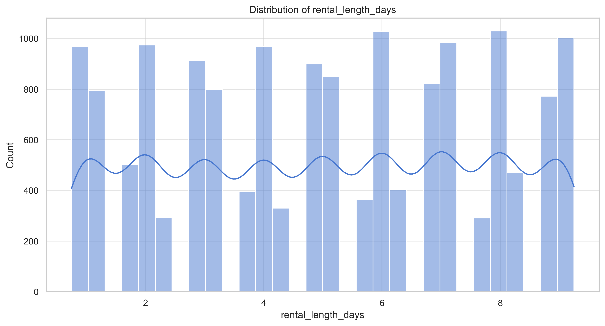
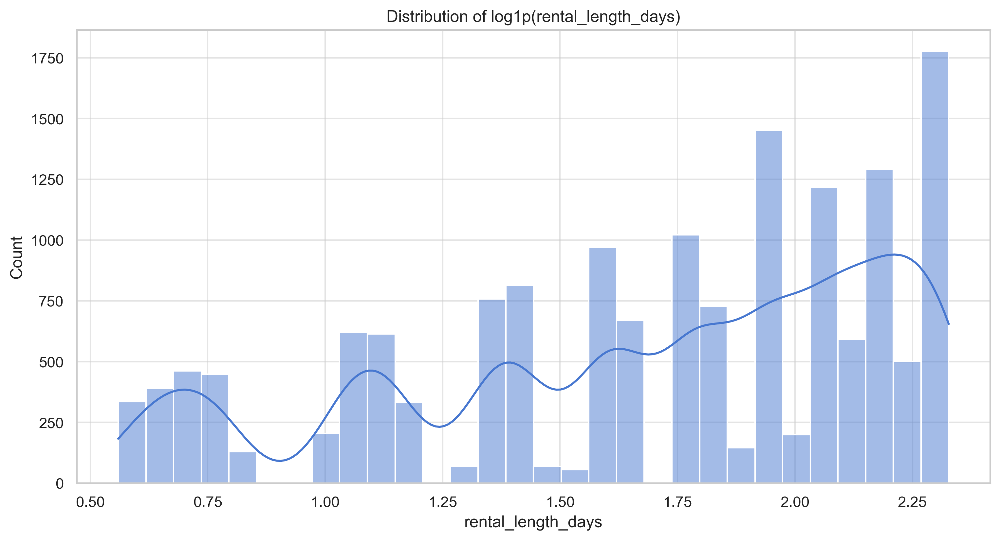
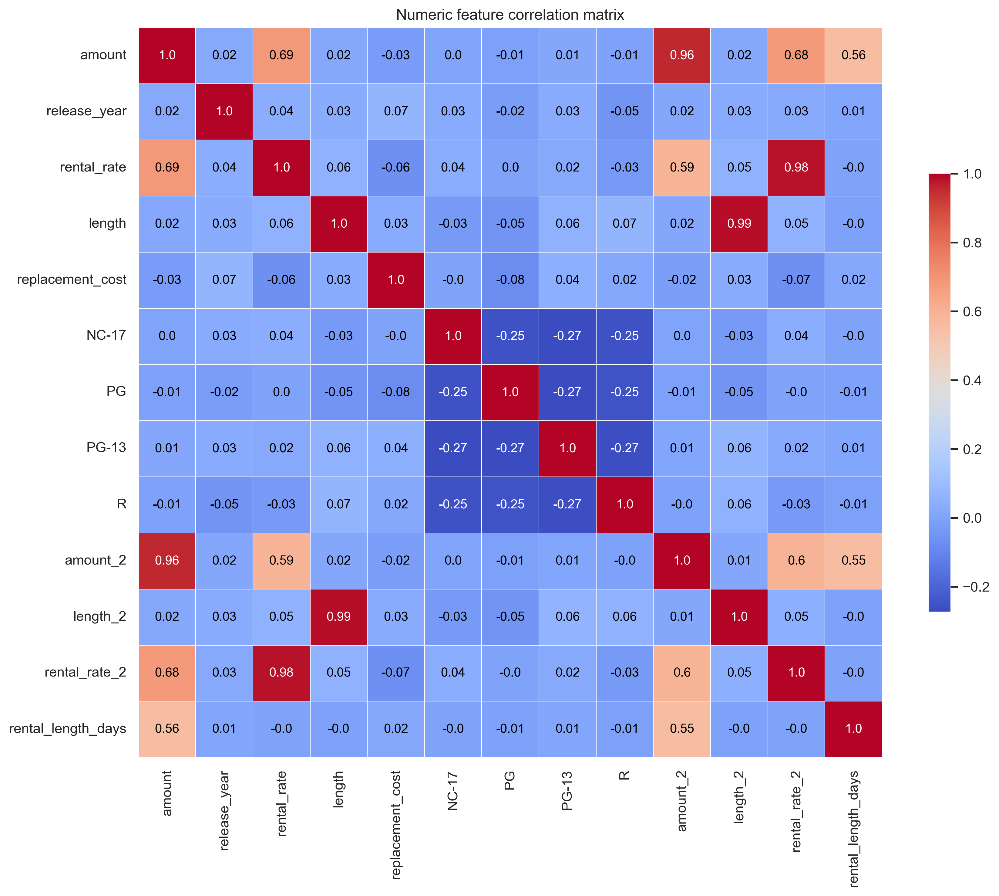
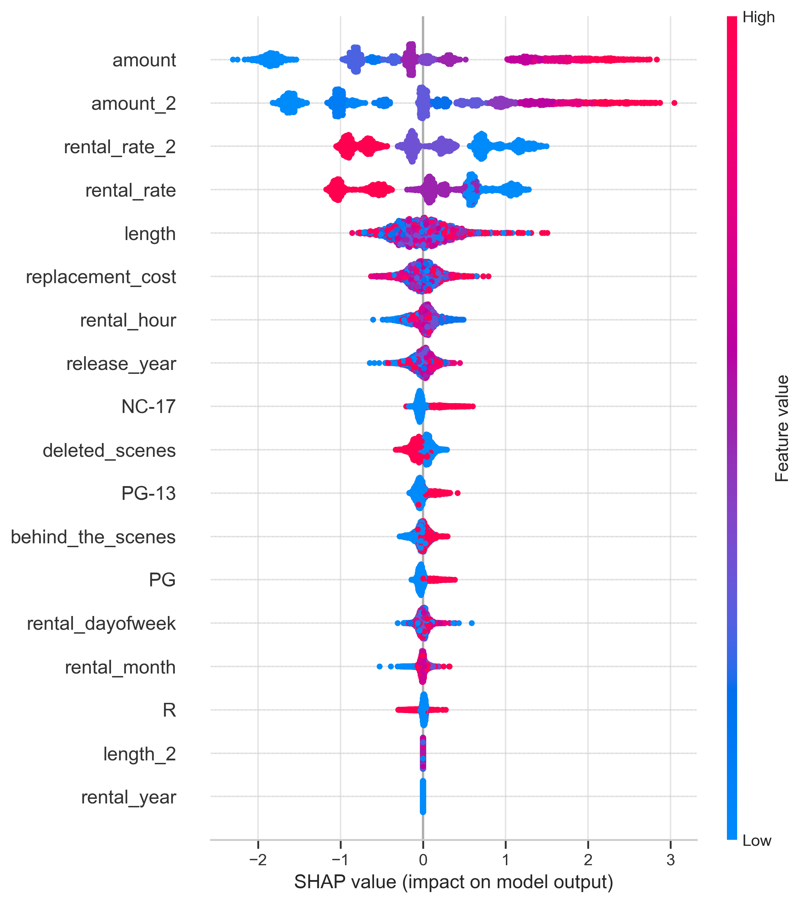
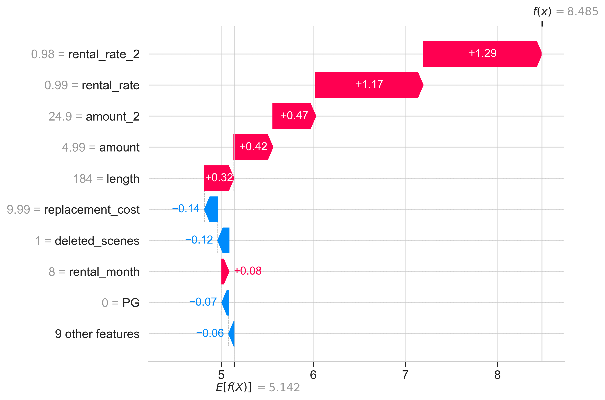

# 📀 DVD Rental Duration Prediction


## 📋 Project Overview

This project predicts the number of days a customer will rent a DVD using regression models and feature engineering. The goal is to provide the DVD rental company with a model that improves inventory planning by forecasting rental durations. The original small-scale project (from DataCamp) has been expanded into a production-ready pipeline with comprehensive EDA, model selection, hyperparameter tuning, explainability (SHAP), and saved model artifacts.

**Project goals:**
- Build predictive models to estimate `rental_length_days`.
- Reach a test-set Mean Squared Error (MSE) <= 3 (project target).
- Provide interpretable explanations for model predictions using SHAP.
- Deliver reproducible code, artifacts, and documentation suitable for a GitHub portfolio.

---

## 📁 Project Structure
```
Predicting-Movie-Rental-Durations/
│ 
├── analysis_files/ 
│   ├── rental_duration_analysis.ipynb             # Main analysis notebook 
│   └── rental_duration_analysis.py                # Main analysis python file
│ 
├── data/ 
│   └── rental_info.csv                            # Dataset 
│ 
├── outputs/                                       # Visualization outputs 
│   ├── best_model.joblib                          # Saved model pipeline
│   ├── target_distribution.png 
│   ├── target_log_distribution.png 
│   ├── correlation_matrix.png 
│   ├── shap_waterfall_0.png 
│   └── shap_summary.png 
│ 
├── requirements.txt                               # Python dependencies 
└── README.md                                      # Project documentation 
```

---
## 🛠️ Required Libraries

All required Python packages are listed in `requirements.txt`. Example key libraries:
- pandas, numpy — data manipulation
- scikit-learn — modeling, pipelines, hyperparameter search
- matplotlib, seaborn — plotting
- shap — explainability
- joblib — save/load model pipeline

---
## 📝 Order

1. Exploratory Data Analysis (EDA)
   - Inspect missing data, data types, and distributions.
   - Plot target distribution (raw and `log1p`) and correlation heatmap.
   - Purpose: understand variable relationships, identify skewness, and spot issues such as multicollinearity.

2. Preprocessing & Feature Engineering
   - Parse `rental_date` and `return_date`, compute `rental_length_days`.
   - Add date features from `rental_date` (hour, day of week, month, year).
   - Create binary flags for `special_features`: `deleted_scenes`, `behind_the_scenes`.
   - Handle numeric/categorical imputation, scaling and encoding via `ColumnTransformer`.

3. Feature selection
   - Use `LassoCV` inside `SelectFromModel` to remove weak/unnecessary features for linear models while keeping the pipeline consistent with tree models.

4. Modeling & hyperparameter tuning
   - Linear models: Ridge and LinearRegression (via pipeline with selector).
   - Tree models: RandomForest and GradientBoosting tuned via `RandomizedSearchCV`.
   - Ensemble: `StackingRegressor` combining tuned RF and GBoost with Ridge meta-learner.
   - Evaluation: cross-validation on training set and hold-out test metrics (MSE, RMSE, MAE, R^2).

5. Explainability
   - SHAP summary plot for global feature importance and a SHAP waterfall for a single instance.
   - Rationale: provide interpretable insights to stakeholders about which features drive rental duration.

6. Persistence and reproducibility
   - Save the full pipeline (preprocessing + selection + estimator) using `joblib.dump` to `outputs/best_model.joblib`.
   - Pin package versions in `requirements.txt` for reproducibility.

---
## 🚀 Installation and Setup

### Prerequisites
Ensure Python 3.8+ and `pip` are installed on your system.

### Steps
1. **Clone the repository:**
   ```bash
   git clone https://github.com/PRSPrithvi/Predicting-Movie-Rental-Durations.git
   ```

2. **Create and activate a virtual environment:**
   * Windows: `python -m venv venv && .\venv\Scripts\activate`
   * macOS/Linux: `python -m venv venv && source venv/bin/activate`

3. **Install dependencies:**
   ```bash
   pip install -r requirements.txt
   ```
---
## 📊 Usage

From the repository root, run:
```bash
python analysis_files/rental_duration_analysis.py
```
This will:
- Run EDA and save plots to `outputs/`.
- Train and tune models, evaluate them on a hold-out test set, and print metrics.
- Compute SHAP explanations and save summary/waterfall plots.
- Save the final pipeline as `outputs/best_model.joblib` for later usage, if required.

Example to load the saved model and predict on new observations:
```python
import joblib
import pandas as pd

model = joblib.load('outputs/best_model.joblib')
# new_data should be a DataFrame with the same raw input columns as training (rental_date, special_features, etc.)
new_data = pd.DataFrame({ ... })
preds = model.predict(new_data)
```
Remember: the saved pipeline includes preprocessing and selection — feed raw columns in the same schema used during training.

---
## 📈 Analysis and Key Findings 🏆 

Summary of key analysis steps and findings. Refer to the saved plots in `outputs/`.

1. Target distribution
 
*Figure 1: Rental durations are discrete with clear peaks at integer day values (1–10 days).*

*Figure 2: Log1p-transformed distribution which smooths variance and can help linear models.*


2. Correlations
 
*Figure 3: Illustrates `amount`, `rental_rate` and `length` (and their squared counterparts) are moderately to strongly positively correlated with rental duration. The squared features are highly collinear with their base features (expected).*
Recommendation: remove or regularize squared features for linear models; tree models tolerate them better.


3. Model performance
Multiple models were trained and evaluated. Final selection was made by test MSE. The best-performing model and its test metrics are saved in `outputs/` and printed by the script.
Reported metrics include MSE, RMSE, MAE (useful to explain average error in days), and R^2.


4. Interpretability (SHAP)
 
*Figure 4: Illustrates `amount` / `amount_2` and `rental_rate_2` / `rental_rate` are the most influential features. Higher amounts and rental rates drive higher predicted rental durations.*
 
*Figure 5: Gives a local explanation for one prediction, decomposing the final prediction into baseline + per-feature contributions.*

---
## 📝 Technical Decisions and Rationale

- Pipeline-based design: ensures preprocessing and selection are applied consistently at training and inference time.
- LassoCV for feature selection: automatically chooses a regularization strength and yields sparse solutions that help interpretability and reduce overfitting for linear models.
- RandomizedSearchCV for tree models: balances search breadth and computational budget; tuned commonly important hyperparameters (n_estimators, max_depth, min_samples_split/leaf, max_features or learning_rate/subsample).
- Stacking ensemble: a robust approach to combine complementary learners (RF and GBoost) and improve performance.
- SHAP for interpretability: provides game-theoretic local and global explanations that are actionable and easily visualized for stakeholders.

---
## 💡 Challenges and Solutions

- **Data leakage risk**: initial attempts included features derived from `return_date` or full rental length. Solution: extract only features from `rental_date` (available at rental time) and use `return_date` solely to compute the target.
- **Multicollinearity due to engineered squared features**: solved via regularization (LassoCV/Ridge) and by using tree models that are less sensitive to collinearity.
- **SHAP performance and pipeline interaction**: explaining pipeline-wrapped models required careful handling (use of `shap.Explainer` on the pipeline predict function or transforming data before explaining). For large datasets, use a representative background sample to speed up SHAP.

---
## 🎯 Results summary

- The best model achieved test **MSE = `1.8571` and MAE = `1.0641`**. MAE (in days) gives a clear business-language error bound: on average the model is off by approximately 1 day.
- **Key drivers**: rental price/rate and movie length — titles with higher prices and longer runtimes tend to be rented for more days.

Recommendation: use the model predictions to adjust stock levels for titles predicted to have longer average rentals. Combine point estimates with prediction intervals (e.g., 75th percentile) for conservative stocking.

---

## 👤 Author

#### GitHub: [@PRSPrithvi](https://github.com/PRSPrithvi)
#### LinkedIn: [Prithvi Raj Singh](https://www.linkedin.com/in/prithvi-raj-singh-b91247235)
#### Email: prithvi020536@gmail.com

---
## 🙏 Acknowledgments
- DataCamp project "Predicting Movie Rental Durations" for the initial dataset and exercise prompt.
- SHAP, scikit-learn and the broader open-source ML ecosystem.

---

## 📚 References
- Lundberg, S. M. & Lee, S.-I. (2017). A Unified Approach to Interpreting Model Predictions. Advances in Neural Information Processing Systems.
- scikit-learn documentation: https://scikit-learn.org
- SHAP documentation: https://github.com/slundberg/shap

---
## ⭐ Star This Repository

If you found this project helpful, please consider giving it a star! It helps others discover this work, as well as me to improve my reach.
